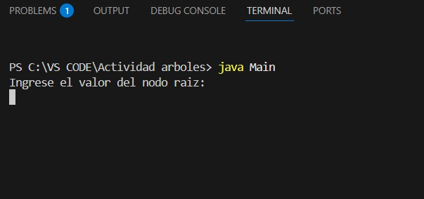
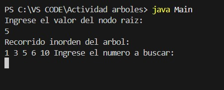
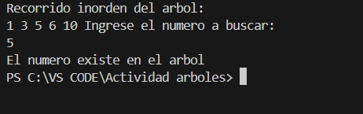
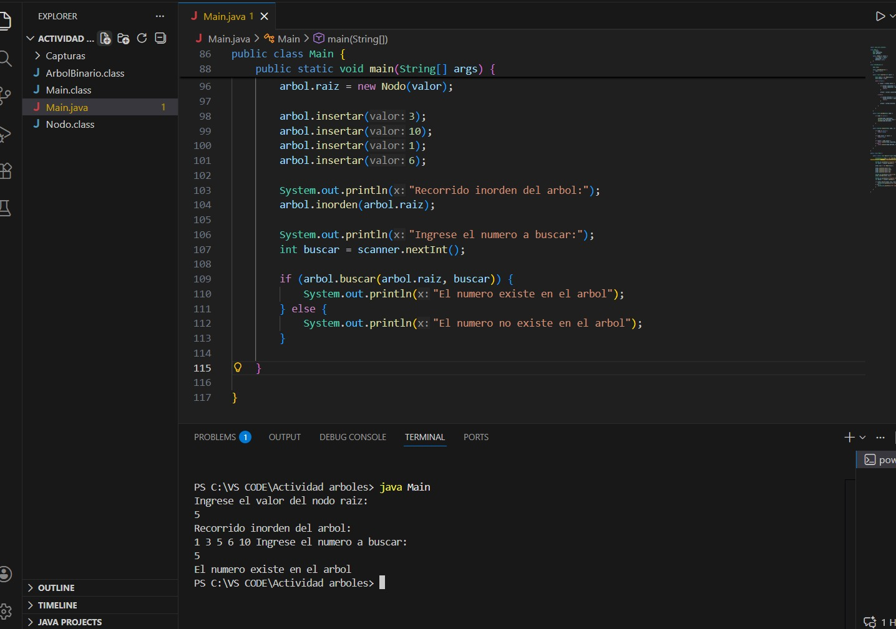

# Árbol Binario en Java

# ¿Qué es un árbol binario?

Un árbol binario es una estructura de datos donde cada nodo puede tener máximo dos hijos: uno izquierdo y uno derecho. Se utiliza para organizar datos de manera jerárquica y facilitar operaciones como búsqueda, inserción y recorrido.

# ¿Cómo se implementó?

El programa fue desarrollado en Java utilizando tres clases principales:

 1. Nodo: representa cada elemento del árbol.
 2. ArbolBinario: contiene los métodos para insertar números, recorrer el árbol en inorden y buscar un valor.
 3. Main: ejecuta el programa y permite interactuar con el usuario desde la consola.

# Ejemplo de ejecución

El programa permite ingresar el valor del nodo raíz, insertar nuevos números en el árbol, mostrar el recorrido inorden y buscar un número dentro del árbol.

## Ejemplo de ejecución

# Integrante

Felipe Carmona Jiménez
